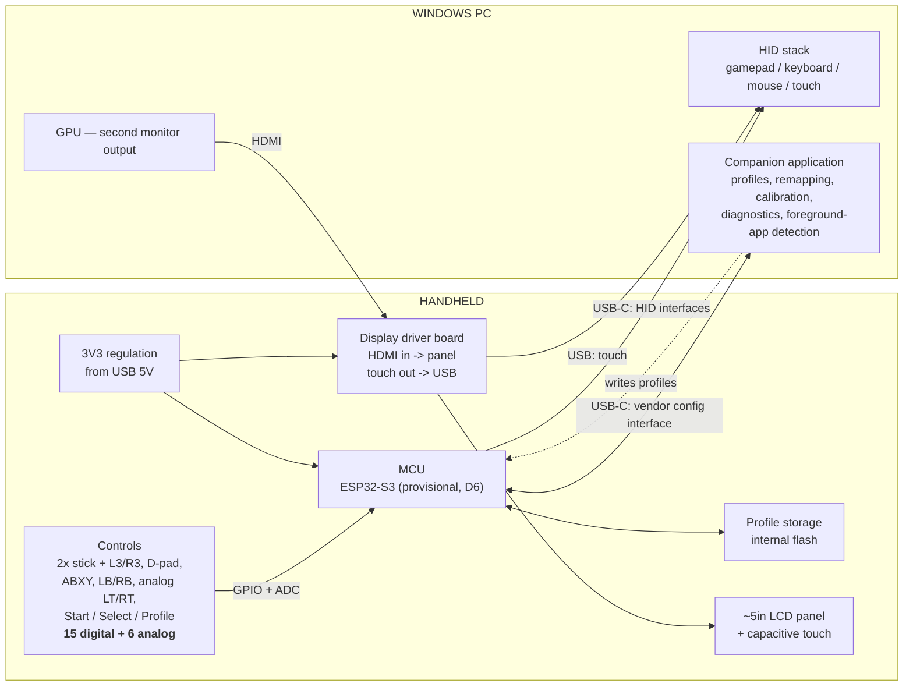

# Block Diagram

**Status:** Current as of 2026-09-10 (D3, D4, D5, D7). Update whenever the architecture changes, and record the change in `DECISIONS.md`.

---

## V1 system



## Interfaces

| # | From | To | Medium | Carries | Proven in |
|---|---|---|---|---|---|
| I1 | Controls | MCU | GPIO + ADC | 15 digital states, 6 analog values | Stage 2 |
| I2 | MCU | Windows | USB-C, HID | Gamepad, keyboard, mouse reports | Stage 3 |
| I3 | Companion app | MCU | USB-C, vendor interface | Profile read/write, calibration, diagnostics | Stage 5 |
| I4 | PC GPU | Driver board | HDMI | Video for the second monitor | Stage 4 |
| I5 | Driver board | Panel | Ribbon | Panel-native video | Stage 4 |
| I6 | Touch controller | Windows | USB | Touch coordinates | Stage 4 |
| I7 | USB 5V | 3V3 rail | PCB | Power for MCU, panel, driver board | Stage 7 |

## Notes on the architecture

- **The control path and the display path are deliberately independent.** The MCU never carries video, and the display subsystem does not depend on the firmware. Either can be developed, tested and debugged without the other.
- **Two cables leave the enclosure in V1:** one USB-C and one HDMI. Reducing this to one cable is out of scope for V1.
- **No SBC and no video streaming** (D3). Those belong to the wireless revision.
- **No battery** (D5). The device is bus-powered; total draw must be verified against the USB budget in Stage 4.

## Future revision, for reference only

Not to be designed or purchased for now. Recorded so the V1 enclosure leaves the internal volume plausible.

```
Windows PC --(WiFi)--> Linux SBC in handheld --(DSI/HDMI)--> panel
MCU --(BLE HID)--> Windows PC
Internal battery + charger + protection --> system rails
```
